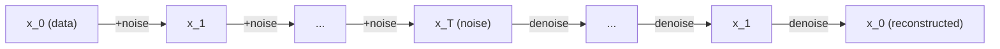

> This post is an excerpt adapted from Lilian Weng's
> ["What are Diffusion Models?"](https://lilianweng.github.io/posts/2021-07-11-diffusion-models/)
> (July 2021), quoted here with attribution to test this blog's math, figure,
> and code rendering. Read the full original for the complete treatment.

So far, there are three types of generative models that have shown great
success in generating high-quality samples: GAN, VAE, and Flow-based models.
Each has limitations of its own — GAN models are known for potentially
unstable training, VAE relies on a surrogate loss, and Flow models have to
use specialized architectures to construct reversible transforms.



Diffusion models are inspired by non-equilibrium thermodynamics. They define
a Markov chain of diffusion steps to slowly add random noise to data, then
learn to reverse the diffusion process to construct desired data samples
from the noise.

Given a data point sampled from a real data distribution $$\mathbf{x}_0 \sim q(\mathbf{x})$$,
the forward diffusion process adds small amounts of Gaussian noise over $$T$$ steps:

$$
q(\mathbf{x}_t \vert \mathbf{x}_{t-1}) = \mathcal{N}(\mathbf{x}_t; \sqrt{1 - \beta_t} \mathbf{x}_{t-1}, \beta_t\mathbf{I})
$$

Here's an uncaptioned illustration straight from the source, embedded via plain Markdown image syntax rather than the figure include:


## Visualizing the process



## A minimal sampling loop

A rough sketch of the reverse sampling loop (not the real DDPM implementation, just illustrative):

```python
import torch

def sample(model, shape, num_steps: int) -> torch.Tensor:
    x = torch.randn(shape)  # start from pure noise
    for t in reversed(range(num_steps)):
        noise_pred = model(x, t)
        x = denoise_step(x, noise_pred, t)
    return x
```

## Setting up an environment to run it

```bash
python -m venv .venv
source .venv/bin/activate
pip install torch numpy
python sample.py --num-steps 1000 --output out.png
```

## A tiny visualization stub

```javascript
function plotNoiseSchedule(betas) {
  return betas.map((beta, t) => ({ t, beta }));
}
```

Cited as:

> Weng, Lilian. (Jul 2021). What are diffusion models? Lil'Log.
> https://lilianweng.github.io/posts/2021-07-11-diffusion-models/.
